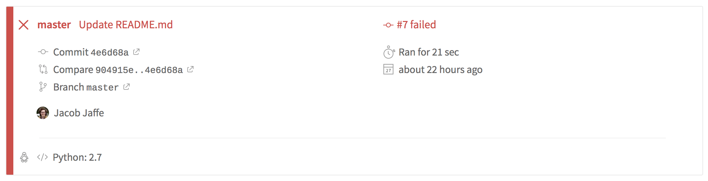

# travis-workshop

[](https://travis-ci.com/JumboCode/travis-workshop)

1. look at that build status. it red and makes us sad. lets make it green so we are happy coders!

2. aw shucks but why is it a sad travis status? let's investigate!
  * click the status (that thing that says ```build failed``` above this

3. hmmmm looks like a build failed 


4. oh okay - it failed because that test failed 

5. let's investigate a little bit (math.py)... ahhh the math is off, okie dokie time to fix it!

6. make a new branch...

7. make the appropriate changes... 

8. run tests locally, either:
 * yay it works 
 * boo it didnt work - go fix it again 
 
10. push branch 

11. click on the travis badge, see that travis for your branch is a happy travis now yay

12. booom u done!
