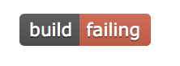
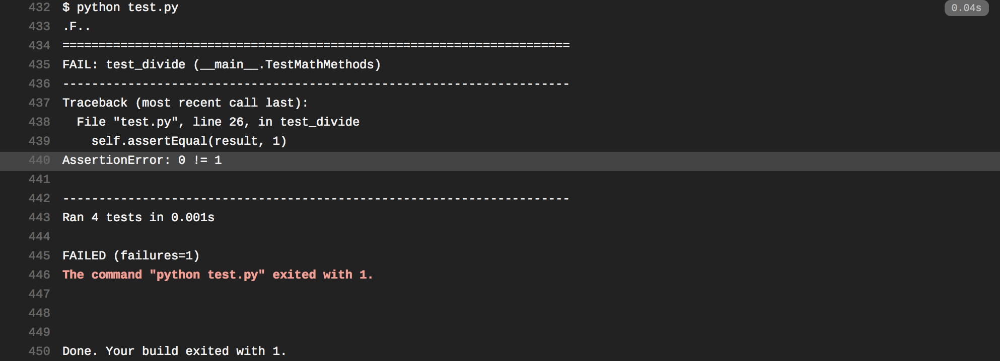

# travis-workshop

direction outline... todo in general but the basics:

1. look at that build status. it red and makes us sad. lets make it green so we are happy coders

2. aw shucks but why is it a sad travis stauts? let's investigate!
  -> click the status
  
  

3. hmmmm looks like a build failed 

4. oh okay it failed cause that test failed 

5. let's investigate a little bit... ahhh the math is off, okie dokie time to fix it:

6. make a new branch...

7. make the appropraite changes... 

8. run tests locally
 -> yay it works 
 -> boo it didnt work go fix it again 
 
10. push brnach

11. see that travis is a happy travis now yay

12. booom u done go high five spenc
